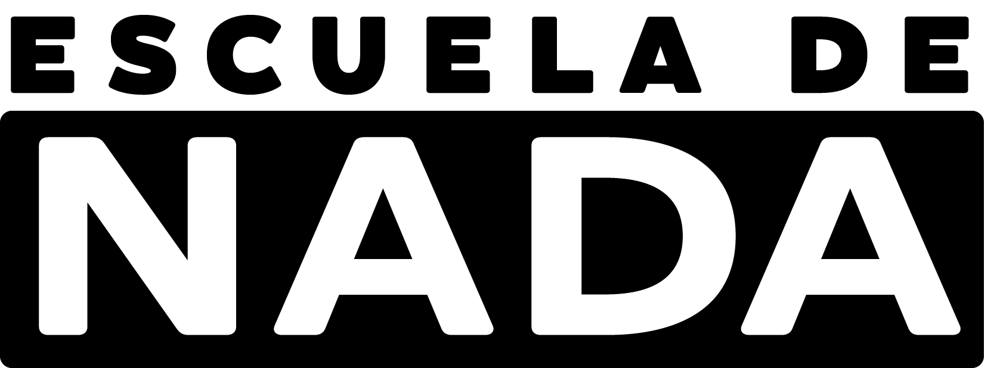

# API de Escuela de Nada 

Esta es una API RESTful basada en el podcast Escuela de Nada. 
Tendrás acceso a una base de datos con información de los mejores momentos, personajes y episodios que 
se creen dentro del universo del podcast. También puedes agregar información y mantener actualizada la data. 


## Documentación

[Documentatión](https://docs.robotlandclub.com/docs)


## Variables de Entorno

Para ejecutar este proyecto, deberá añadir las siguientes variables de entorno a su archivo .env

` ENVIRONMENT = [el entorno donde se va a ejecutar] `

` JWT_PASS = [la key para desencriptar el jwt] `

` MONGO_URL = [dirección de la base de datos] `

` PORT = [ el puerto donde se va a ejecutar] `

` HOST = [ de donde van a provenir las peticiones ] `

` API_URL = 'https://api.robotlandclub.com/api' `

` DOCS_URL = 'https://docs.robotlandclub.com' `


## Úsalo localmente
tienes que descargar e instalar [MongoDB](https://www.mongodb.com) y tener [Node](https://nodejs.org/es/).


Clona el repositorio

```bash
  git clone https://link-to-project
```

Ve a donde se clono el proyecto

```bash
  cd my-project
```

Instala las dependencias

```bash
  npm install
```

Inicia el servidor

```bash
  npm run dev
```


## Contribuir al proyecto

Esta es una api de código abierto asi que cualquier ayuda esta bienvenida.

Puedes ver `contributing.md` para darte una idea por donde empezar.

y también mantente apegado al ``code of conduct` si quieres colaborar con el proyecto.

### Puedes ayudar a mantener el proyecto 

[Ayuda a mantener el proyecto vivo](https://docs.robotlandclub.com/support)

Si quieres conocer mas a cerca del proyecto puedes verlo [aquí](https://docs.robotlandclub.com/about)

## Authors

- [@piedraprog](https://www.github.com/octokatherine)


